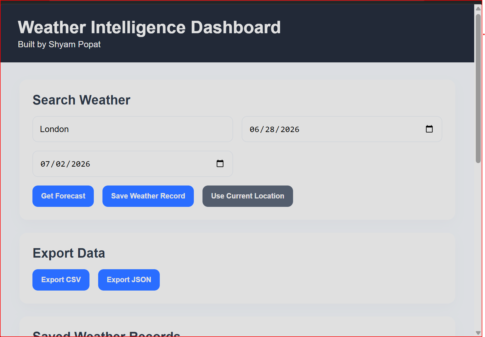
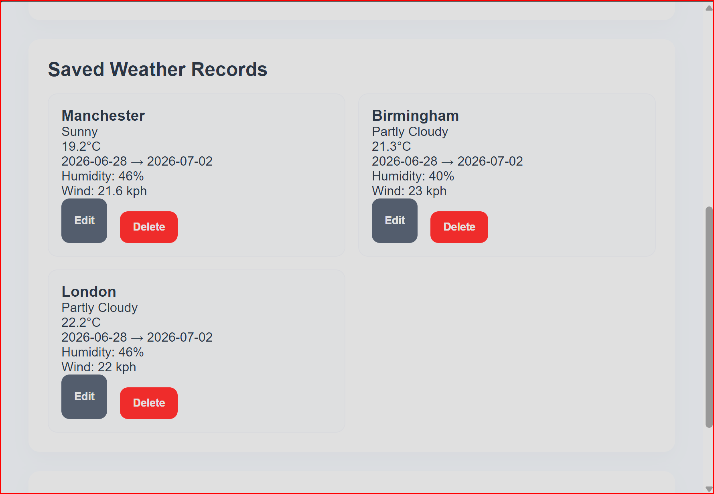
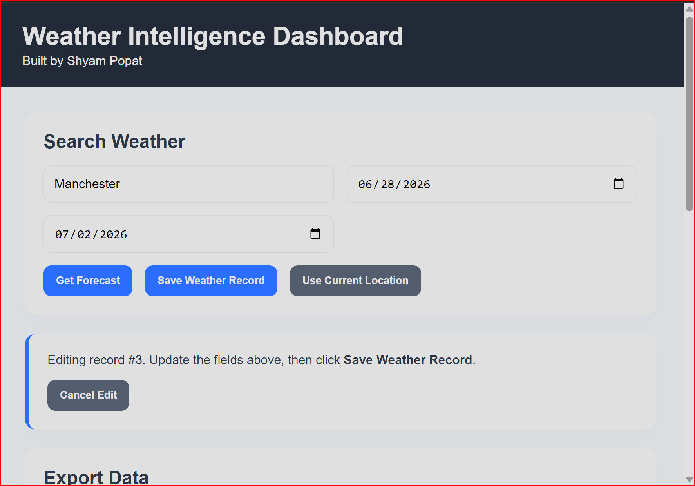
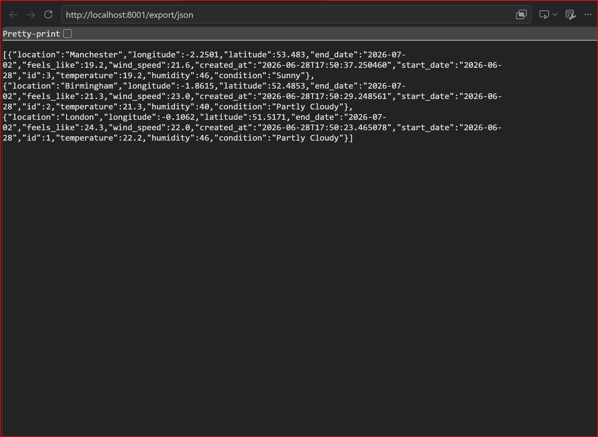
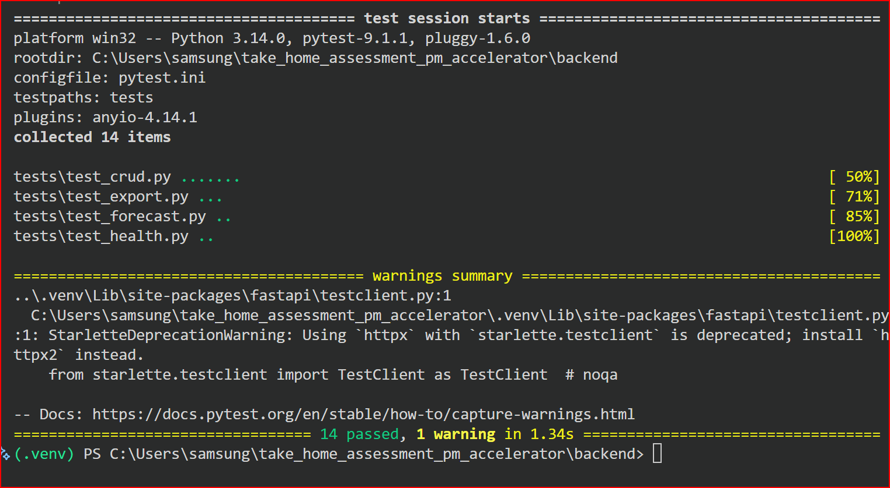

# Weather Intelligence Dashboard

A full-stack Weather Intelligence Dashboard built for the PM Accelerator Take Home Assessment.

The application allows users to search for weather forecasts, save weather records, update existing records, export data, and manage saved locations through a clean React frontend backed by a FastAPI REST API.

---

## Architecture

See the [system architecture documentation](docs/architecture.md) for an overview of the frontend, API, service, caching, integration, and persistence layers.

---

# Features

## Weather Forecasting

- Search weather by city name
- Display current weather conditions
- Display 5-day weather forecast
- View:
  - Temperature
  - Feels Like
  - Humidity
  - Wind Speed
  - UV Index
  - Weather Condition

---

## CRUD Operations

Users can:

- Create weather records
- View saved weather records
- Update existing records
- Delete saved records

---

## Export

Export saved weather data as:

- CSV
- JSON

---

## Error Handling

Graceful handling for:

- Invalid locations
- API failures
- Network errors
- Geolocation permission denied
- Loading states

---

## Current Location

Uses the browser Geolocation API to retrieve the user's current coordinates and display weather information.

If permission is denied, a friendly error message is displayed.

---

## Redis Caching

Forecast and current-weather responses from the external WeatherAPI provider are cached in Redis.

Caching provides:

- Faster repeated weather requests
- Fewer external API calls
- Configurable cache expiration using TTL values
- Separate cache keys for each location and forecast duration
- Graceful fallback to WeatherAPI when Redis is unavailable

Example cache keys:

```text
weather:current:london
weather:forecast:london:5
```

---

# Tech Stack

## Frontend

- React
- TypeScript
- Vite
- Axios
- React Icons

## Backend

- FastAPI
- Python
- Pydantic
- HTTPX
- Pytest

---

# Project Structure

```
take_home_assessment_pm_accelerator/

│
├── backend/
│   ├── app/
│   ├── tests/
│   ├── requirements.txt
│   └── README.md
│
├── frontend/
│   ├── src/
│   │
│   ├── components/
│   ├── pages/
│   ├── services/
│   ├── hooks/
│   ├── types/
│   │
│   ├── package.json
│   └── vite.config.ts
│
└── README.md
```

---

# Running the Backend

Navigate to the backend directory:

```bash
cd backend
```

Create a virtual environment (optional):

```bash
python -m venv .venv
```

Activate it:

Windows

```bash
.venv\Scripts\activate
```

Install dependencies:

```bash
pip install -r requirements.txt
```

Run the API:

```bash
uvicorn app.main:app --reload --port 8001
```

Swagger documentation:

```
http://localhost:8001/docs
```

---

# Running the Frontend

Navigate to:

```bash
cd frontend
```

Install packages:

```bash
npm install
```

Run Vite:

```bash
npm run dev
```

Open:

```
http://localhost:5173
```

---

# Running Tests

Backend tests:

```bash
cd backend

pytest
```

Current test results:

```
15 passed
```

---

# API Endpoints

| Method | Endpoint | Description |
|---------|----------|-------------|
| GET | /weather/forecast/{location} | Get weather forecast |
| POST | /weather/ | Save weather record |
| GET | /weather/ | Retrieve saved records |
| PUT | /weather/{id} | Update record |
| DELETE | /weather/{id} | Delete record |
| GET | /export/csv | Export CSV |
| GET | /export/json | Export JSON |

---

# Assumptions

- Weather data is retrieved from an external weather provider.
- Browser geolocation requires user permission.
- Export downloads all saved weather records.
- Forecasts are displayed for up to five days.

---

## Screenshots

### Dashboard



---

### Saved Weather Records



---

### Edit Weather Record



---

### Export



---

### Automated Tests



---

# Future Improvements

- Authentication
- Database persistence (PostgreSQL)
- Search history
- Weather maps
- Dark mode
- Responsive mobile layout
- Unit tests for React components
- Docker deployment

---

# Author

**Shyam Popat**

Built for the **PM Accelerator Take Home Assessment**.