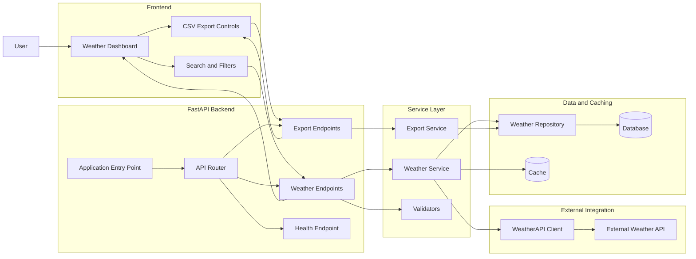

# Weather Intelligence Dashboard Architecture

## System overview

The Weather Intelligence Dashboard uses a layered architecture to retrieve weather data, validate and process requests, cache and persist results, and present information through a frontend dashboard and CSV exports.

